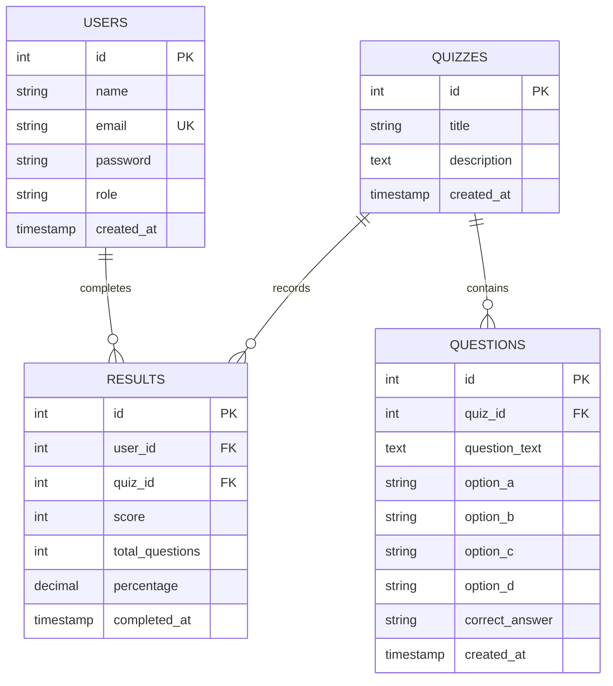

# 🎮 Quiz Realm — Interactive Gamified Quiz Platform
> **A Decoupled Full-Stack Web Application built with React 18 (Vite), Tailwind CSS, Vanilla PHP 8 REST API, and MySQL Database.**


---

## 📑 Complete Academic & Project Table of Contents

| Chapter No. | Chapter Name | Section Link |
| :---: | :--- | :--- |
| **1** | **Introduction** | [1. Introduction](#chapter-1-introduction) |
| **2** | **Limitation of Existing System** | [2. Limitation of Existing System](#chapter-2-limitation-of-existing-system) |
| **3** | **Objectives** | [3. Objectives](#chapter-3-objectives) |
| **4** | **Scope** | [4. Scope](#chapter-4-scope) <br> └─ 4.1 [Functional Scope](#41-functional-scope) <br> └─ 4.2 [Technical Scope](#42-technical-scope) |
| **5** | **Technology Stack Detailed Analysis** | [5. Technology Stack Detailed Analysis](#chapter-5-technology-stack-detailed-analysis) |
| **6** | **Advantages** | [6. Advantages](#chapter-6-advantages) |
| **7** | **System Design & Database Architecture** | [7. System Design](#chapter-7-system-design) <br> ├─ 7.1 [System Modules & Use Cases](#71-system-modules--use-cases) <br> └─ 7.2 [Database Design & Data Dictionary](#72-database-design--data-dictionary) |
| **8** | **Screenshots & UI Layout Descriptions** | [8. Screenshots & UI Layout Descriptions](#chapter-8-screenshots--ui-layout-descriptions) |
| **9** | **ER-Diagram & Architectural Schematics** | [9. ER-Diagram & Architectural Schematics](#chapter-9-er-diagram--architectural-schematics) <br> ├─ 9.1 [ER-Diagram](#91-entity-relationship-er-diagram) <br> ├─ 9.2 [Layered Architecture Diagram](#92-layered-architecture-diagram) <br> └─ 9.3 [Auth Sequence Flow](#93-complete-auth--session-sequence-flow) |
| **10** | **Software Testing** | [10. Software Testing](#chapter-10-software-testing) <br> └─ 10.1 [Detailed Test Cases Suite](#101-detailed-test-cases-suite) |
| **11** | **Project Directory Structure** | [11. Project Directory Structure](#chapter-11-project-directory-structure) |
| **12** | **API Documentation** | [12. API Documentation](#chapter-12-api-documentation) |
| **13** | **Installation & Setup Guide** | [13. Installation & Setup Guide](#chapter-13-installation--setup-guide) |
| **14** | **Top College Viva Questions & Answers** | [14. Top College Viva Questions & Answers](#chapter-14-top-college-viva-questions--answers) |
| **15** | **References & Bibliography** | [15. References & Bibliography](#chapter-15-references--bibliography) |

---

## CHAPTER 1: INTRODUCTION

### 1.1 Project Overview
In modern Educational Technology (EdTech), traditional online assessment systems often fail to engage students due to monotonous user interfaces, delayed score feedback, full-page reload latencies, and rigid grading layouts. **Quiz Realm** is a modern, gamified web application engineered to bridge the gap between rigorous academic evaluation and modern web aesthetics.

The platform establishes a dual-interface ecosystem:
1. **Student / Adventurer Portal**: A gamified quiz-taking engine where students attempt quizzes, earn Experience Points (XP), increase their level, unlock RPG rank titles (e.g., *Sorcerer*, *Vanguard*, *Titan*), inspect past quest logs, customize hero avatars, and compete on a live leaderboard.
2. **Admin / Guild Master Portal**: A secure administration center where instructors can perform full CRUD operations on quizzes and questions, review individual student submission scores, and monitor system analytics.

### 1.2 Purpose & Significance
The primary purpose of Quiz Realm is to demonstrate a production-grade **Decoupled Web Architecture**:
- **Frontend**: A fast Single Page Application (SPA) built with React 18, Vite 5, and Tailwind CSS.
- **Backend**: A lightweight RESTful JSON API built with Vanilla PHP 8 adhering to Layered Architecture (Controllers, Business Logic Services, Middleware, and Data Access Singleton).
- **Security Protocols**: Production-level protection against Cross-Site Scripting (XSS) via **HttpOnly Cookie JWT Authentication** and immunity against SQL Injection via **PDO Prepared Statements**.

---

## CHAPTER 2: LIMITATION OF EXISTING SYSTEM

Legacy quiz web applications and basic PHP projects suffer from severe architectural and security vulnerabilities:

| Legacy System Limitation | Impact on User Experience & Security | Solution in Quiz Realm |
| :--- | :--- | :--- |
| **Monolithic Page Reloads** | Every question submission or link navigation forces a full browser reload, causing high latency and server load. | **React Single Page Application (SPA)**: Asynchronous data fetching via `fetch` API ensures zero full-page reloads. |
| **LocalStorage Auth Vulnerability** | Storing sensitive JWT tokens or session flags in browser `localStorage` or `sessionStorage` exposes them to XSS script theft. | **HttpOnly Cookies**: Auth tokens are issued via `setcookie()` with `httponly: true`, `samesite: 'Lax'`, invisible to JavaScript. |
| **SQL Injection Risks** | Concatenating string inputs directly into SQL queries (`"SELECT * FROM users WHERE email='" . $email . "'"`) allows query hijacking. | **PDO Prepared Statements**: 100% of SQL queries use parameter binding (`$stmt->prepare()` and `$stmt->execute()`). |
| **Page Refresh Auth Bugs** | Refreshing the browser on a protected page wipes React in-memory state, prematurely bouncing logged-in users to `/login`. | **Automated Session Rehydration**: On mount, React calls `GET /api/auth/me.php` with `credentials: 'include'`. The browser transmits the HttpOnly cookie, restoring user state seamlessly. |
| **Lack of Student Engagement** | Static text-based quizzes lead to low completion rates and student disinterest. | **Gamification Engine**: Integrates XP points, player levels, rank badges, custom gamer avatars, and a live leaderboard podium. |

---

## CHAPTER 3: OBJECTIVES

The technical and functional objectives of Quiz Realm are:

1. **Decoupled Architecture**: Construct a clean RESTful API using Vanilla PHP 8 adhering to Layered Architecture (Controllers, Services, Middleware, Data Access Layer) paired with a React 18 SPA.
2. **Robust Authentication**: Implement stateless JWT authentication encapsulated inside `HttpOnly` cookies set directly by the server.
3. **Resilient Session Management**: Prevent auth state loss upon browser refresh using an automated rehydration flow backed by React `AuthContext` and an `isMounted` lifecycle guard.
4. **Automated Evaluation Engine**: Build a server-side scoring engine that evaluates student answers against database answer keys, calculates percentages, and logs results atomically.
5. **Gamification & User Experience**: Create a rich, cartoon-inspired UI complete with animated Skeleton Loaders, responsive design, avatar selectors, level progression, and leaderboards.
6. **Comprehensive Admin Governance**: Provide full CRUD capabilities for quizzes and questions with relational cascade cleanup (`ON DELETE CASCADE`).

---

## CHAPTER 4: SCOPE

### 4.1 Functional Scope

#### A. Student / Player Features
- **Registration & Authentication**: User sign-up with email validation, unique gamer tag check, and secure login.
- **Quiz Quest Catalog**: View available quizzes filtered by categories (Science, Tech, Trivia).
- **Interactive Quiz Engine**: Take quizzes with real-time options, submit answers, and receive instant score breakdowns.
- **Leveling & XP Engine**: Earn XP based on percentage scores; unlock RPG ranks (*Sorcerer*, *Vanguard*, *Titan*).
- **Leaderboard Podium**: View top-ranked players across the system sorted by total XP score.
- **Quest History Log**: Inspect full history of past test attempts with completion timestamps.
- **Hero Profile & Avatar Customization**: Select and switch custom gamer avatars (Yeti, Sorcerer, Ninja, etc.).

#### B. Admin / Guild Master Features
- **Admin Dashboard**: Overview metrics showing total active quizzes, total questions, and overall student attempts.
- **Quiz Management (CRUD)**: Create new quizzes, update titles/descriptions, and delete obsolete quizzes.
- **Question Management (CRUD)**: Add questions with 4 options and set correct answer keys ('a', 'b', 'c', 'd'); delete questions.
- **Student Performance Analytics**: Review full log of student attempts across all quizzes with detailed score percentages.

### 4.2 Technical Scope
- **Frontend Stack**: React 18, Vite 5, Tailwind CSS 3, Lucide Icons, React Router DOM 6.
- **Backend Stack**: PHP 8.0+ REST API (Vanilla, no framework overhead), JSON response specification.
- **Database Engine**: MySQL 5.7+ / MariaDB, InnoDB storage engine, UTF-8 unicode encoding.
- **Security Protocols**: HTTP-only cookies, SameSite policy, Bcrypt password hashing (`PASSWORD_DEFAULT`), CORS credentials handling.

---

## CHAPTER 5: TECHNOLOGY STACK DETAILED ANALYSIS

```
 ┌─────────────────────────────────────────────────────────────────────────┐
 │                            FRONTEND STACK                               │
 ├───────────────────┬─────────────────────────────────────────────────────┤
 │ Library / Tool    │ Purpose & Technical Justification                   │
 ├───────────────────┼─────────────────────────────────────────────────────┤
 │ React 18          │ Declarative component-based UI rendering, state     │
 │                   │ hooks (useState, useEffect, useContext).            │
 │ Vite 5            │ Next-generation frontend tooling providing sub-second│
 │                   │ HMR (Hot Module Replacement) and optimized bundling.│
 │ Tailwind CSS 3    │ Utility-first CSS framework enabling modern,        │
 │                   │ responsive cartoon-style design system.             │
 │ React Router 6    │ Client-side routing with custom `<ProtectedRoute>`  │
 │                   │ and `<PublicRoute>` guards.                         │
 │ Lucide React      │ Lightweight, scalable SVG icon library.             │
 └───────────────────┴─────────────────────────────────────────────────────┘

 ┌─────────────────────────────────────────────────────────────────────────┐
 │                            BACKEND STACK                                │
 ├───────────────────┬─────────────────────────────────────────────────────┤
 │ Technology / Tool │ Purpose & Technical Justification                   │
 ├───────────────────┼─────────────────────────────────────────────────────┤
 │ PHP 8.0+          │ Pure, lightweight RESTful API server executing      │
 │                   │ business logic synchronously per HTTP request.      │
 │ Layered Pattern   │ Clean separation of concerns into API Controllers   │
 │                   │ (`api/`), Services (`services/`), and Middleware.   │
 │ PDO Engine        │ PHP Data Objects providing prepared statements,     │
 │                   │ error exceptions, and associative array fetching.   │
 │ JWT (HMAC SHA256) │ Custom header-payload-signature JWT generator &     │
 │                   │ verifier built without heavy external libraries.    │
 └───────────────────┴─────────────────────────────────────────────────────┘

 ┌─────────────────────────────────────────────────────────────────────────┐
 │                           DATABASE & SERVER                             │
 ├───────────────────┬─────────────────────────────────────────────────────┤
 │ Database / Server │ Purpose & Technical Justification                   │
 ├───────────────────┼─────────────────────────────────────────────────────┤
 │ MySQL 5.7+        │ Relational database enforcing foreign key integrity │
 │                   │ and cascading deletions (`ON DELETE CASCADE`).      │
 │ Apache / XAMPP    │ Web server environment serving PHP API endpoints.   │
 └───────────────────┴─────────────────────────────────────────────────────┘
```

---

## CHAPTER 6: ADVANTAGES

1. **High Performance & Zero Page Reloads**: React Single Page Application (SPA) architecture combined with Vite ensures lightning-fast page transitions and optimal bandwidth usage.
2. **Enterprise Security Standards**:
   - **XSS Shield**: Auth tokens are stored in `HttpOnly` cookies set directly by PHP, rendering them immune to malicious JavaScript extraction.
   - **SQL Injection Shield**: PDO Prepared Statements separate query structure from parameter data.
   - **Bcrypt Hashing**: User passwords are never stored in plain text.
3. **Resilient User Experience**: Automated session rehydration and animated Skeleton Loaders prevent UI flickering or accidental redirects during page refreshes or rapid multi-clicks (`Ctrl+R`).
4. **Gamification & Engagement**: Higher student retention through XP points, RPG rank progression, avatar customization, and competitive leaderboards.
5. **Maintainable Modular Codebase**: Decoupled Layered Architecture allows independent updates to frontend UI or backend database schema without breaking existing contracts.

---

## CHAPTER 7: SYSTEM DESIGN

### 7.1 System Modules & Use Cases

#### A. Module Breakdown
1. **Authentication Module**: Manages registration, credential verification, HttpOnly cookie set/clear, and session rehydration (`/api/auth/*`).
2. **Quiz Engine Module**: Delivers quiz lists, fetches single quiz data (hiding correct answer keys for students), and handles quiz CRUD (`/api/quizzes/*`).
3. **Question Management Module**: Supports adding, editing, and deleting questions with 4 option fields and designated answer keys (`/api/questions/*`).
4. **Scoring & Evaluation Module**: Evaluates submitted answers against database records, computes scores and percentages, and updates student logs (`/api/results/submit.php`).
5. **Leaderboard & Analytics Module**: Aggregates total XP scores across users for leaderboard rankings and outputs student performance logs for admins (`/api/results/*`).

#### B. Use Case Diagram Schematic

```
                    ┌─────────────────────────┐
                    │      STUDENT USER       │
                    └────────────┬────────────┘
                                 │
     ┌───────────────────────────┼───────────────────────────┐
     ▼                           ▼                           ▼
[Take Quiz Quest]       [View Leaderboard]          [Customize Profile]
     │                           │                           │
     └───────────────────────────┼───────────────────────────┘
                                 │
                                 ▼
                     ┌──────────────────────┐
                     │   Quiz Realm System  │
                     └───────────┬──────────┘
                                 ▲
     ┌───────────────────────────┼───────────────────────────┐
     │                           │                           │
[Manage Quizzes (CRUD)]  [Manage Questions]     [View Student Results]
     ▲                           ▲                           ▲
     │                           │                           │
     └───────────────────────────┴───────────────────────────┘
                                 │
                    ┌────────────┴────────────┐
                    │       ADMIN USER        │
                    └─────────────────────────┘
```

---

### 7.2 Database Design & Data Dictionary

The database **`quiz_app`** consists of 4 normalized tables enforcing primary/foreign key constraints.

#### Full Database Schema SQL (`schema.sql`)

```sql
CREATE DATABASE IF NOT EXISTS quiz_app DEFAULT CHARACTER SET utf8mb4 COLLATE utf8mb4_unicode_ci;
USE quiz_app;

-- 1. Users Table
CREATE TABLE IF NOT EXISTS users (
    id INT AUTO_INCREMENT PRIMARY KEY,
    name VARCHAR(100) NOT NULL,
    email VARCHAR(150) NOT NULL UNIQUE,
    password VARCHAR(255) NOT NULL,
    role ENUM('student', 'admin') NOT NULL DEFAULT 'student',
    created_at TIMESTAMP DEFAULT CURRENT_TIMESTAMP
) ENGINE=InnoDB DEFAULT CHARSET=utf8mb4;

-- 2. Quizzes Table
CREATE TABLE IF NOT EXISTS quizzes (
    id INT AUTO_INCREMENT PRIMARY KEY,
    title VARCHAR(255) NOT NULL,
    description TEXT NULL,
    created_at TIMESTAMP DEFAULT CURRENT_TIMESTAMP
) ENGINE=InnoDB DEFAULT CHARSET=utf8mb4;

-- 3. Questions Table
CREATE TABLE IF NOT EXISTS questions (
    id INT AUTO_INCREMENT PRIMARY KEY,
    quiz_id INT NOT NULL,
    question_text TEXT NOT NULL,
    option_a VARCHAR(255) NOT NULL,
    option_b VARCHAR(255) NOT NULL,
    option_c VARCHAR(255) NOT NULL,
    option_d VARCHAR(255) NOT NULL,
    correct_answer ENUM('a', 'b', 'c', 'd') NOT NULL,
    created_at TIMESTAMP DEFAULT CURRENT_TIMESTAMP,
    CONSTRAINT fk_questions_quiz FOREIGN KEY (quiz_id) REFERENCES quizzes(id) ON DELETE CASCADE
) ENGINE=InnoDB DEFAULT CHARSET=utf8mb4;

-- 4. Results Table
CREATE TABLE IF NOT EXISTS results (
    id INT AUTO_INCREMENT PRIMARY KEY,
    user_id INT NOT NULL,
    quiz_id INT NOT NULL,
    score INT NOT NULL,
    total_questions INT NOT NULL,
    percentage DECIMAL(5,2) NOT NULL,
    completed_at TIMESTAMP DEFAULT CURRENT_TIMESTAMP,
    CONSTRAINT fk_results_user FOREIGN KEY (user_id) REFERENCES users(id) ON DELETE CASCADE,
    CONSTRAINT fk_results_quiz FOREIGN KEY (quiz_id) REFERENCES quizzes(id) ON DELETE CASCADE
) ENGINE=InnoDB DEFAULT CHARSET=utf8mb4;
```

#### Data Dictionary Tables

##### 1. `users` Table
| Field Name | Data Type | Nullable | Key | Default | Description |
| :--- | :--- | :---: | :---: | :--- | :--- |
| `id` | `INT` | NO | PK | `AUTO_INCREMENT` | Unique user identifier. |
| `name` | `VARCHAR(100)` | NO | - | - | User display name / Gamer Tag. |
| `email` | `VARCHAR(150)` | NO | UK | - | Unique email address. |
| `password` | `VARCHAR(255)` | NO | - | - | Bcrypt hashed password. |
| `role` | `ENUM('student','admin')` | NO | - | `'student'` | System access level. |
| `created_at`| `TIMESTAMP` | NO | - | `CURRENT_TIMESTAMP` | Account creation date. |

##### 2. `quizzes` Table
| Field Name | Data Type | Nullable | Key | Default | Description |
| :--- | :--- | :---: | :---: | :--- | :--- |
| `id` | `INT` | NO | PK | `AUTO_INCREMENT` | Unique quiz identifier. |
| `title` | `VARCHAR(255)` | NO | - | - | Quiz title. |
| `description`| `TEXT` | YES | - | `NULL` | Quiz topic description. |
| `created_at`| `TIMESTAMP` | NO | - | `CURRENT_TIMESTAMP` | Quiz creation date. |

##### 3. `questions` Table
| Field Name | Data Type | Nullable | Key | Default | Description |
| :--- | :--- | :---: | :---: | :--- | :--- |
| `id` | `INT` | NO | PK | `AUTO_INCREMENT` | Unique question identifier. |
| `quiz_id` | `INT` | NO | FK | - | Foreign Key to `quizzes(id)` (`ON DELETE CASCADE`). |
| `question_text`| `TEXT` | NO | - | - | The question prompt text. |
| `option_a` | `VARCHAR(255)` | NO | - | - | Choice Option A. |
| `option_b` | `VARCHAR(255)` | NO | - | - | Choice Option B. |
| `option_c` | `VARCHAR(255)` | NO | - | - | Choice Option C. |
| `option_d` | `VARCHAR(255)` | NO | - | - | Choice Option D. |
| `correct_answer`| `ENUM('a','b','c','d')` | NO | - | - | The designated correct option key. |
| `created_at`| `TIMESTAMP` | NO | - | `CURRENT_TIMESTAMP` | Question creation date. |

##### 4. `results` Table
| Field Name | Data Type | Nullable | Key | Default | Description |
| :--- | :--- | :---: | :---: | :--- | :--- |
| `id` | `INT` | NO | PK | `AUTO_INCREMENT` | Unique result identifier. |
| `user_id` | `INT` | NO | FK | - | Foreign Key to `users(id)` (`ON DELETE CASCADE`). |
| `quiz_id` | `INT` | NO | FK | - | Foreign Key to `quizzes(id)` (`ON DELETE CASCADE`). |
| `score` | `INT` | NO | - | - | Total correct answers scored. |
| `total_questions`| `INT` | NO | - | - | Total questions in the quiz. |
| `percentage`| `DECIMAL(5,2)` | NO | - | - | Calculated score percentage. |
| `completed_at`| `TIMESTAMP` | NO | - | `CURRENT_TIMESTAMP` | Quiz submission timestamp. |

---

## CHAPTER 8: SCREENSHOTS & UI LAYOUT DESCRIPTIONS

1. **Landing Page (`/`)**: Hero banner introducing the platform with call-to-action buttons ("Start Adventuring", "Guild Master Portal") and feature cards.
2. **Player Sign In (`/login`) & Registration (`/register`)**: Cartoon-styled forms with client-side validation, password toggles, and clear error alert banners, wrapped in `<PublicRoute>`.
3. **Student Dashboard (`/dashboard`)**: Hero banner displaying player level, current rank title, total XP earned, and active avatar alongside active quest cards and the leaderboard widget.
4. **Interactive Quiz Quest Interface (`/quiz/:quizId`)**: Question counter, progress bar, question prompt card, and 4 option buttons with instant selection highlighting.
5. **Result & Evaluation Screen (`/result/:resultId`)**: Victory/Defeat banner with animated score percentage badge, correct/incorrect counters, and calculated XP points.
6. **Quest Log History (`/history`)**: Tabular history of all completed attempts showing quiz title, score percentage, XP earned, pass/fail status, and date.
7. **Hero Profile & Avatar Customization (`/profile`)**: Hero card with XP level progress bar, avatar preview, statistics grid, unlocked badges (First Blood, Sharpshooter, Quest Master), and modal avatar picker.
8. **Admin Guild Master Control Center (`/admin/dashboard`)**: Overview statistic cards (Total Quizzes, Total Questions, Total Submissions) and action shortcuts.
9. **Quiz & Question Builder (`/admin/quizzes` & `/admin/quizzes/:quizId/questions`)**: Form modals for adding/editing quizzes and questions with option fields A/B/C/D and radio selectors for answer keys.

---

## CHAPTER 9: ER-DIAGRAM & ARCHITECTURAL SCHEMATICS

### 9.1 Entity-Relationship (ER) Diagram



#### ASCII ER Schematic

```
 +------------------+            1 : N            +------------------+
 |      USERS       |----------------------------<|     RESULTS      |
 +------------------+                             +------------------+
 | PK  id           |                               | PK  id           |
 |     name         |                               | FK  user_id      |
 | UK  email        |                               | FK  quiz_id      |
 |     password     |                               |     score        |
 |     role         |                               |     total_quest  |
 |     created_at   |                               |     percentage   |
 +------------------+                               |     completed_at |
                                                    +------------------+
                                                             |
                                                             | N : 1
                                                             v
 +------------------+            1 : N            +------------------+
 |     QUIZZES      |----------------------------<|    QUESTIONS     |
 +------------------+                             +------------------+
 | PK  id           |                             | PK  id           |
 |     title        |                             | FK  quiz_id      |
 |     description  |                             |     question_txt |
 |     created_at   |                             |     option_a     |
 +------------------+                             |     option_b     |
                                                  |     option_c     |
                                                  |     option_d     |
                                                  |     correct_ans  |
                                                  |     created_at   |
                                                  +------------------+
```

### 9.2 Layered Architecture Diagram

```
                  ┌────────────────────────────────────────┐
                  │          React Frontend (Vite)         │
                  │   AuthContext | Router | Tailwind UI   │
                  └───────────────────┬────────────────────┘
                                      │ HTTP Fetch Request
                                      │ (credentials: 'include')
                                      ▼
┌─────────────────────────────────────────────────────────────────────────────┐
│                            PHP RESTful API Backend                          │
│                                                                             │
│  1. CORS Middleware      ──► includes/cors.php                             │
│                              (Credentials & Localhost Preflight)            │
│                                                                             │
│  2. API Controllers      ──► api/auth/login.php   (Sets HttpOnly Cookie)   │
│                              api/auth/me.php      (Session Rehydration)     │
│                              api/quizzes/list.php  (Quiz Operations)        │
│                              api/results/submit.php (Scoring Engine)        │
│                                                                             │
│  3. Middleware & Helpers ──► includes/auth-check.php (JWT Cookie Verifier) │
│                              includes/jwt.php        (HMAC SHA-256)         │
│                              includes/response.php   (Standard JSON Shape)  │
│                                                                             │
│  4. Business Services    ──► services/AuthService.php                       │
│     (Layered Architecture)   services/QuizService.php                       │
│                              services/ResultService.php                     │
│                                                                             │
│  5. Database Layer       ──► config/db.php (PDO Singleton Connection)        │
└─────────────────────────────────────┬───────────────────────────────────────┘
                                      │ PDO SQL Queries
                                      ▼
                      ┌──────────────────────────────┐
                      │    MySQL Database Server     │
                      │        (quiz_app DB)         │
                      └──────────────────────────────┘
```

### 9.3 Complete Auth & Session Sequence Flow

```
   User Browser              React AuthContext             PHP Backend          MySQL Database
        │                            │                         │                       │
        │─── 1. Login Form Submit ──►│                         │                       │
        │                            │─── 2. POST /login ─────►│                       │
        │                            │     (email, password)   │─── 3. SELECT User ───►│
        │                            │                         │◄── 4. Return Hash ────│
        │                            │                         │                       │
        │                            │                         │── 5. Verify Password &│
        │                            │                         │      Generate JWT     │
        │                            │◄── 6. Set-Cookie ───────│                       │
        │                            │    (quiz_app_token;     │                       │
        │                            │     HttpOnly; Lax)      │                       │
        │                            │                         │                       │
        │─── 7. F5 Page Refresh ────►│                         │                       │
        │                            │─── 8. GET /me ─────────►│                       │
        │                            │ (cookie attached auto)  │── 9. Verify JWT ─────►│
        │                            │◄── 10. User JSON ───────│                       │
        │◄── 11. Render Dashboard ───│                         │                       │
```

---

## CHAPTER 10: SOFTWARE TESTING

### Testing Methodology
The application underwent structural manual testing across multiple vectors:
1. **Unit & Functional Testing**: Verified individual API responses and UI component states.
2. **Integration Testing**: Checked end-to-end data flow from React inputs through PHP services to MySQL tables.
3. **Security Testing**: Tested against XSS cookie theft, SQL Injection inputs, and unauthorized RBAC access.
4. **Resiliency Testing**: Conducted rapid multi-refresh stress testing (`Ctrl+R` 3-4 times) to confirm zero auth state loss.

### 10.1 Detailed Test Cases Suite

| Test ID | Module | Pre-conditions | Test Steps | Expected Result | Actual Result | Status |
| :---: | :--- | :--- | :--- | :--- | :--- | :---: |
| **TC-01** | Auth | User on Register page | Fill valid name, email, password; click Register | Account created in DB; success message shown | User registered successfully | **PASS** |
| **TC-02** | Auth | Existing registered account | Enter correct email & password on Login page | Backend sets HttpOnly cookie; user redirected to `/dashboard` | HttpOnly cookie set; redirected to dashboard | **PASS** |
| **TC-03** | Auth | Valid session active | Press `Ctrl+R` rapid refresh 3 times on `/dashboard` | Skeleton Loader displays; session rehydrates; user stays on `/dashboard` | Session rehydrated seamlessly without login redirect | **PASS** |
| **TC-04** | Security | Unauthenticated visitor | Manually type `/dashboard` in browser URL bar | `<ProtectedRoute>` intercepts; redirects to `/login` | Redirected to `/login` | **PASS** |
| **TC-05** | Security | Student role user | Send POST to `/api/quizzes/create.php` via fetch | Backend `requireAuth('admin')` halts request with HTTP 403 | Returns HTTP 403 Forbidden error | **PASS** |
| **TC-06** | Security | Login input field | Enter `' OR '1'='1` in email field | PDO prepared statement treats input as literal string; rejects login | Returns HTTP 401 Invalid Credentials | **PASS** |
| **TC-07** | Quiz Engine | Student user on quiz page | Select options A, B, C; click Submit Quest | Server evaluates score against DB answer key; saves result record | Score & XP calculated accurately; saved in `results` table | **PASS** |
| **TC-08** | Admin CRUD| Admin user logged in | Create new Quiz titled "Web Tech 101"; add 3 questions | Quiz & questions inserted into DB; visible in student quest list | Quiz & questions saved and visible to students | **PASS** |
| **TC-09** | Admin Cascade| Admin user logged in | Delete Quiz "Web Tech 101" | Quiz, questions, and test results deleted via `ON DELETE CASCADE` | Linked records deleted automatically | **PASS** |
| **TC-10** | Auth Logout| Authenticated user | Click Logout button in Navbar | POST `/api/auth/logout.php` expires cookie; user redirected to `/login` | Cookie expired; user redirected to `/login` | **PASS** |

---

## CHAPTER 11: PROJECT DIRECTORY STRUCTURE

```
quiz-app/
├── schema.sql                     # Database Schema SQL script
├── README.md                      # Comprehensive Project & Documentation File
├── BACKEND_CHEAT_SHEET.md         # Detailed Backend & Viva Defense Cheatsheet
├── backend/                       # PHP RESTful API
│   ├── .env                       # Backend Environment Variables
│   ├── config/
│   │   ├── env.php                # Environment Loader
│   │   └── db.php                 # PDO Database Singleton
│   ├── includes/
│   │   ├── cors.php               # CORS & Options Preflight Handler
│   │   ├── response.php           # Standardized JSON Response Helpers
│   │   ├── jwt.php                # HMAC SHA-256 Token Generator & Verifier
│   │   └── auth-check.php         # HttpOnly Cookie Auth Middleware
│   ├── services/
│   │   ├── AuthService.php        # User Login / Registration Logic
│   │   ├── QuizService.php        # Quiz CRUD Service
│   │   ├── QuestionService.php    # Question CRUD Service
│   │   └── ResultService.php      # Automated Scoring Engine & Leaderboard
│   └── api/                       # API Route Controllers
│       ├── auth/
│       │   ├── login.php          # POST /api/auth/login.php
│       │   ├── register.php       # POST /api/auth/register.php
│       │   ├── logout.php         # POST /api/auth/logout.php
│       │   └── me.php             # GET /api/auth/me.php
│       ├── quizzes/
│       │   ├── list.php           # GET /api/quizzes/list.php
│       │   ├── get.php            # GET /api/quizzes/get.php?id=...
│       │   ├── create.php         # POST /api/quizzes/create.php (Admin)
│       │   ├── update.php         # POST /api/quizzes/update.php (Admin)
│       │   └── delete.php         # POST /api/quizzes/delete.php (Admin)
│       ├── questions/
│       │   ├── create.php         # POST /api/questions/create.php (Admin)
│       │   ├── update.php         # POST /api/questions/update.php (Admin)
│       │   └── delete.php         # POST /api/questions/delete.php (Admin)
│       └── results/
│           ├── submit.php         # POST /api/results/submit.php
│           ├── history.php        # GET /api/results/history.php
│           ├── leaderboard.php    # GET /api/results/leaderboard.php
│           └── admin-list.php     # GET /api/results/admin-list.php (Admin)
└── frontend/                      # React SPA (Vite)
    ├── package.json
    ├── vite.config.js
    ├── tailwind.config.js
    └── src/
        ├── main.jsx
        ├── App.jsx
        ├── api/
        │   └── client.js          # Central Fetch Client (credentials: 'include')
        ├── context/
        │   └── AuthContext.jsx    # Auth Context & Session Rehydration
        ├── services/
        │   ├── authService.js
        │   ├── quizService.js
        │   └── resultService.js
        ├── components/
        │   ├── Navbar.jsx
        │   ├── ProtectedRoute.jsx # Student & Admin Guard
        │   ├── PublicRoute.jsx    # Guest Guard
        │   ├── common/
        │   │   ├── SkeletonLoader.jsx # Shimmer Cartoon Loading UI
        │   │   ├── StatCard.jsx
        │   │   └── Modal.jsx
        │   └── quiz/
        │       ├── QuizCard.jsx
        │       └── LeaderboardWidget.jsx
        └── pages/
            ├── Landing.jsx
            ├── Login.jsx
            ├── Register.jsx
            ├── Dashboard.jsx      # Student Dashboard
            ├── TakeQuiz.jsx       # Quiz Engine
            ├── Result.jsx         # Attempt Results
            ├── History.jsx        # Quest Log
            ├── Profile.jsx        # Hero Profile & Avatar Selector
            └── admin/
                ├── AdminLogin.jsx
                ├── AdminDashboard.jsx
                ├── ManageQuizzes.jsx
                ├── ManageQuestions.jsx
                └── StudentResults.jsx
```

---

## CHAPTER 12: API DOCUMENTATION

All API responses follow a standardized JSON schema:
```json
{
  "success": true,
  "data": { ... },
  "error": null
}
```

### Core Auth Endpoints

| Method | Endpoint | Access | Description |
| :--- | :--- | :--- | :--- |
| `POST` | `/api/auth/register.php` | Public | Registers a new student account (`name`, `email`, `password`). |
| `POST` | `/api/auth/login.php` | Public | Authenticates credentials & sets `HttpOnly` `quiz_app_token` cookie. |
| `POST` | `/api/auth/logout.php` | Public | Clears `HttpOnly` cookie and invalidates session. |
| `GET`  | `/api/auth/me.php` | Authenticated | Validates session cookie & returns user profile `{ id, name, email, role }`. |

### Quiz & Question Endpoints

| Method | Endpoint | Access | Description |
| :--- | :--- | :--- | :--- |
| `GET`  | `/api/quizzes/list.php` | Authenticated | Retrieves active quizzes list with question count. |
| `GET`  | `/api/quizzes/get.php?id=...` | Student/Admin | Fetches quiz details & questions (correct answer key hidden for students!). |
| `POST` | `/api/quizzes/create.php` | Admin Only | Creates new quiz title & description. |
| `POST` | `/api/quizzes/update.php` | Admin Only | Updates existing quiz details. |
| `POST` | `/api/quizzes/delete.php` | Admin Only | Deletes quiz (cascades linked questions & results). |
| `POST` | `/api/questions/create.php` | Admin Only | Adds question with 4 options and answer key. |
| `POST` | `/api/questions/delete.php` | Admin Only | Removes a specific question. |

### Scoring & Results Endpoints

| Method | Endpoint | Access | Description |
| :--- | :--- | :--- | :--- |
| `POST` | `/api/results/submit.php` | Student | Submits answer sheet, evaluates score server-side, saves attempt. |
| `GET`  | `/api/results/history.php` | Student | Fetches student's past quiz attempts and XP history. |
| `GET`  | `/api/results/leaderboard.php` | Authenticated | Returns overall top player leaderboard. |
| `GET`  | `/api/results/admin-list.php` | Admin Only | Retrieves all student submission logs across all quizzes. |

---

## CHAPTER 13: INSTALLATION & SETUP GUIDE

### Prerequisites
- **Node.js**: v16+ & `npm` installed.
- **PHP**: v8.0+ installed (XAMPP / WAMP / MAMP or standalone PHP CLI).
- **MySQL Database**: v5.7+ / MariaDB running.

### Step 1: Database Setup
1. Open MySQL Admin (phpMyAdmin or MySQL Workbench).
2. Import `schema.sql` into your database server:
   ```bash
   mysql -u root -p < schema.sql
   ```

### Step 2: Backend Configuration
1. Navigate to `backend/` directory:
   ```bash
   cd backend
   ```
2. Create or verify `.env` file inside `backend/`:
   ```ini
   DB_HOST=localhost
   DB_NAME=quiz_app
   DB_USER=root
   DB_PASS=
   JWT_SECRET=super_secret_quiz_app_key_2026
   ```
3. Place the `quiz-app` directory inside your web server root (e.g., `htdocs/quiz-app` for XAMPP).
4. Verify backend is accessible at: `http://localhost/quiz-app/backend/api/auth/me.php`

### Step 3: Frontend Setup
1. Open a terminal and navigate to `frontend/`:
   ```bash
   cd frontend
   ```
2. Install dependencies:
   ```bash
   npm install
   ```
3. Start Vite Development Server:
   ```bash
   npm run dev
   ```
4. Open your browser at: `http://localhost:5173`

---

## CHAPTER 14: TOP COLLEGE VIVA QUESTIONS & ANSWERS

Here are exact answers to give when your professor asks about the architecture and implementation:

#### Q1: What architecture did you follow for your backend?
> **Answer**: "We built a RESTful API backend using Vanilla PHP with a layered architecture—separating concerns into API Controllers (`api/`), Business Logic Services (`services/`), Helper/Middleware routines (`includes/`), and Data Access configuration (`config/`). It communicates with the React frontend using JSON over HTTP."

#### Q2: How do you connect PHP to MySQL, and why?
> **Answer**: "We use **PDO (PHP Data Objects)** because PDO supports prepared statements for preventing SQL injection, provides object-oriented database interaction, supports error exception handling, and yields associative arrays easily."

#### Q3: How do you protect your API against SQL Injection attacks?
> **Answer**: "All database queries use PDO Prepared Statements (`$stmt->prepare()` and `$stmt->execute([$param])`). Parameters are bound separately from SQL query structure, preventing malicious user input from altering SQL command logic."

#### Q4: How is User Authentication handled? Is it Session-based or Token-based? Where is the token stored?
> **Answer**: "It is **stateless JWT authentication using secure HttpOnly cookies**. When a user logs in, the backend signs a JWT token containing the user's ID, email, and role, and sets it in an `HttpOnly`, `SameSite=Lax` browser cookie (`quiz_app_token`). Because the cookie is `HttpOnly`, JavaScript cannot access or read it, protecting against XSS attacks. The browser automatically transmits the cookie with `credentials: 'include'` on every API request. On page refresh, React rehydrates user state by querying `GET /api/auth/me.php`."

#### Q5: What happens when an authenticated user refreshes the page?
> **Answer**: "When refreshed, React context starts empty (`user: null`, `initializing: true`). `AuthContext` executes an automated session verification request (`GET /api/auth/me.php`) with `credentials: 'include'`. The browser sends the `HttpOnly` cookie, PHP verifies the JWT signature, and returns user data. React updates context state (`setUser(data.user)`) and turns off `initializing`, allowing `ProtectedRoute` to render the protected page seamlessly without redirecting to `/login`."

#### Q6: What happens in the database when a Quiz is deleted by an Admin?
> **Answer**: "Because we defined `ON DELETE CASCADE` foreign key constraints on the `questions` and `results` tables referencing `quizzes(id)`, deleting a quiz automatically removes all associated questions and student test results cleanly without orphaned records."

#### Q7: How do you prevent unauthorized users (students) from adding or deleting quizzes?
> **Answer**: "We implemented Role-Based Access Control (RBAC) in `auth-check.php`. Admin routes call `requireAuth('admin')`, which decodes the JWT token and verifies `role === 'admin'`. Non-admin requests receive an HTTP 403 Forbidden response."

#### Q8: Why use `password_hash()` instead of MD5 or SHA1?
> **Answer**: "MD5 and SHA1 are obsolete, fast cryptographic hashes vulnerable to collision and rainbow table attacks. `password_hash()` uses **Bcrypt**, which automatically handles cryptographic salting and work factor (key stretching), making brute-force attacks computationally infeasible."

---

## CHAPTER 15: REFERENCES & BIBLIOGRAPHY

### References
1. **React Documentation**: *React 18 Hooks and Context API Specification*. [https://react.dev](https://react.dev)
2. **Vite Build Tool**: *Next Generation Frontend Tooling Guide*. [https://vitejs.dev](https://vitejs.dev)
3. **Tailwind CSS**: *Utility-First CSS Framework Documentation*. [https://tailwindcss.com](https://tailwindcss.com)
4. **PHP Manual**: *PHP 8 Data Objects (PDO) and Session Cookie Management*. [https://www.php.net/manual/en/book.pdo.php](https://www.php.net/manual/en/book.pdo.php)
5. **RFC 7519**: *JSON Web Token (JWT) Standard Specification*. Internet Engineering Task Force (IETF). [https://datatracker.ietf.org/doc/html/rfc7519](https://datatracker.ietf.org/doc/html/rfc7519)
6. **OWASP Top 10 Security Risks**: *Cross-Site Scripting (XSS) & SQL Injection Prevention Cheat Sheets*. Open Web Application Security Project. [https://owasp.org](https://owasp.org)

### Bibliography
1. Nixon, Robin. *Learning PHP, MySQL & JavaScript: With jQuery, CSS & HTML5*. 5th Edition, O'Reilly Media, 2018.
2. Banks, Alex, and Eve Porcello. *Learning React: Modern Patterns for Developing React Applications*. 2nd Edition, O'Reilly Media, 2020.
3. Welling, Luke, and Laura Thomson. *PHP and MySQL Web Development*. 5th Edition, Addison-Wesley Professional, 2016.
4. Duckett, Jon. *JavaScript and JQuery: Interactive Front-End Web Development*. Wiley, 2014.

---
*Quiz Realm — Complete Master Academic Documentation & Technical Reference.*
